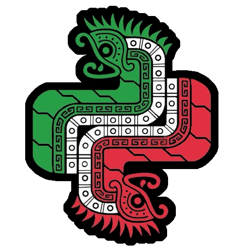

# <i class="fab fa-python"></i> Acerca de Python CDMX

  

**#PythonCDMX** es un grupo de personas interesadas en aprender y compartir su conocimiento sobre el lenguaje de programación Python. El objetivo es estar en contacto con más gente interesada en innovación y tecnología.

---

## <i class="fas fa-history"></i> Historia y evolución

### <i class="fas fa-rocket"></i> Los inicios (2023)
La comunidad Python CDMX surgió de la necesidad de crear un espacio dedicado específicamente a Python en la Ciudad de México. Con nuestro primer meetup en septiembre de 2023, comenzamos un viaje que nos ha llevado a convertirnos en una de las comunidades técnicas más activas de la capital.

### <i class="fas fa-chart-line"></i> Crecimiento (2024-2025)
Durante este período consolidamos nuestro formato de eventos mensuales, establecimos colaboraciones clave con empresas e instituciones académicas, y ampliamos nuestro alcance tanto en número de asistentes como en diversidad de temas cubiertos.

---

## <i class="fas fa-gem"></i> Filosofía y valores

### <i class="fas fa-users"></i> Inclusividad
Creemos que el conocimiento debe ser accesible para todos. No importa si eres un principiante absoluto o un desarrollador senior, hay un lugar para ti en nuestra comunidad.

### <i class="fas fa-lightbulb"></i> Aprendizaje colaborativo
Fomentamos un ambiente donde las preguntas son bienvenidas, los errores son oportunidades de aprendizaje, y todos tienen algo valioso que aportar.

### <i class="fas fa-flask"></i> Innovación responsable
Exploramos las últimas tendencias y tecnologías, pero siempre con un enfoque práctico y responsable hacia el desarrollo de software.

---

## <i class="fas fa-user-friends"></i> Equipo organizador

### <i class="fas fa-user-tie"></i> Coordinadores principales
Nuestro equipo está formado por desarrolladores Python con experiencia en la industria y pasión por la educación y el crecimiento de la comunidad tecnológica en México.

### <i class="fas fa-hands-helping"></i> Voluntarios y colaboradores
La comunidad crece gracias al apoyo de voluntarios que ayudan con logística, contenido, promoción y documentación de eventos.

---

## <i class="fas fa-bolt"></i> Impacto en la comunidad

### <i class="fas fa-briefcase"></i> Desarrollo profesional
Muchos miembros han encontrado nuevas oportunidades laborales, han mejorado sus habilidades técnicas, o han iniciado proyectos propios gracias a las conexiones hechas en la comunidad.

### <i class="fas fa-code-branch"></i> Contribución al ecosistema
La comunidad ha generado proyectos open source, ha contribuido a la documentación en español de Python, y ha servido como plataforma para que desarrolladores mexicanos compartan su trabajo con una audiencia más amplia.

---

## <i class="fas fa-users-cog"></i> Formas de participar

### <i class="fas fa-user"></i> Para asistentes
- Asiste a meetups mensuales
- Participa en discusiones en Telegram
- Haz networking con otros desarrolladores
- Accede a recursos educativos compartidos

### <i class="fas fa-chalkboard-teacher"></i> Para ponentes
- Propón charlas técnicas sobre Python
- Comparte experiencias profesionales
- Presenta proyectos open source
- Facilita talleres prácticos

### <i class="fas fa-hands-helping"></i> Para colaboradores
- Ayuda con logística de eventos
- Contribuye a la documentación
- Apoya en promoción y redes sociales
- Mentoriza a nuevos miembros

---

## <i class="fas fa-link"></i> Contacto y recursos

### <i class="fab fa-telegram"></i> Canales principales
- [Telegram](https://t.me/PythonCDMX) — Comunidad diaria activa
- [Meetup](https://www.meetup.com/python-mexico) — Registro de eventos
- [GitHub](https://github.com/python-cdmx) — Proyectos y código
- [YouTube](https://www.youtube.com/@PythonMexico) — Archivo de charlas

### <i class="fas fa-building"></i> Para organizadores
Si representas una empresa o institución interesada en colaborar, o si quieres proponer una charla, contáctanos a través de nuestros canales oficiales.

---

## <i class="fas fa-users"></i> Nuestra Cultura

En Python CDMX creemos que la comunidad la hacemos todos. Nos esforzamos por crear un ambiente seguro, divertido y colaborativo donde cada voz cuenta.

- Nos reunimos el segundo martes de cada mes.
- Fomentamos la participación, el respeto y la colaboración.
- ¡Ayudamos a mantener los espacios limpios y ordenados!
- Reconocemos y agradecemos a nuestros sponsors y sedes, como Wizeline y Clara.
- Colaboramos activamente con empresas (como Wizeline México), instituciones académicas (como la UNAM Facultad de Ciencias) y otras comunidades tecnológicas.

---

## <i class="fas fa-network-wired"></i> Comunidades Amigas

Participamos en el ecosistema más amplio de comunidades tecnológicas en México, colaborando en eventos conjuntos y compartiendo recursos con:

- RustMX
- LIDSOL
- AWS User Group Ajolotes en la Nube
- PyTalavera
- Sudo FCiencias
- GitTogether CDMX
- Fedora México
- PyLadies Cuernavaca

---

  <b>Python CDMX — Construyendo el futuro con Python, una línea de código a la vez.</b>

