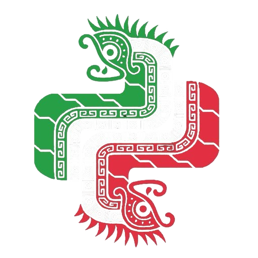
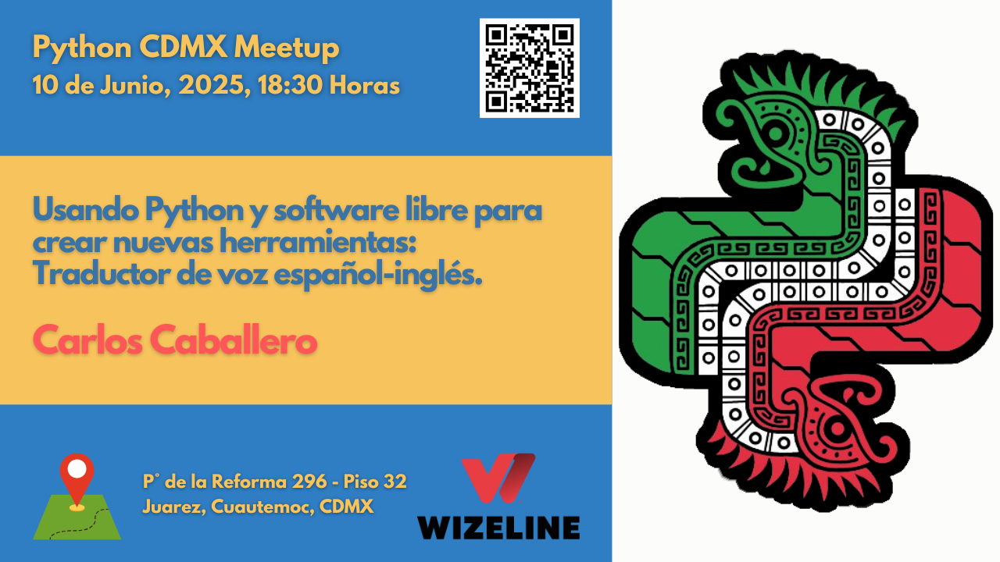

# Python CDMX <i class="fab fa-python"></i>

  <b>¡Vine por el código, me quedé por la comunidad!</b>

  <h2>Comunidad Python en la Ciudad de México</h2>
  
Conectamos desarrolladores, compartimos conocimiento y construimos el futuro con Python.

  

    <h3><i class="fas fa-calendar-alt"></i> 3+ Años</h3>
    
<b>de actividad</b>

  

  

    <h3><i class="fas fa-microphone"></i> 50+ Charlas</h3>
    
<b>realizadas</b>

  

  

    <h3><i class="fas fa-users"></i> 1000+ Miembros</h3>
    
<b>en la comunidad</b>

  

---

## <i class="fas fa-users"></i> ¿Quiénes Somos?

**#PythonCDMX** es un grupo de personas interesadas en aprender y compartir su conocimiento sobre el lenguaje de programación Python. El objetivo es estar en contacto con más gente interesada en innovación y tecnología.

Nuestros meetups incluyen:

- <i class="fas fa-graduation-cap"></i> **Charlas técnicas** sobre Python y tecnologías relacionadas
- <i class="fas fa-laptop-code"></i> **Talleres prácticos** con ejemplos de código real
- <i class="fas fa-handshake"></i> **Networking** con otros desarrolladores de la comunidad
- <i class="fas fa-comments"></i> **Discusiones** sobre mejores prácticas y tendencias

---

## <i class="fas fa-calendar-alt"></i> Próximos Meetups

### [Ver Meetups 2025](meetups/2025/index.md)

<i class="fas fa-calendar"></i> **Descubre nuestros próximos eventos y las charlas más recientes.**

---

## <i class="fas fa-plus-circle"></i> Únete a Nuestra Comunidad

---

## <i class="fas fa-microphone"></i> ¿Quieres Dar una Charla?

¿Tienes algo interesante que compartir con la comunidad? ¡Nos encantaría escucharte!

Ahora puedes proponer tu charla o postularte como ponente de manera sencilla:

- Si tienes una **idea de charla** o quieres postularte, abre un [issue usando la plantilla "💡 Propuesta de Charla"](https://github.com/PythonMexico/pythonCDMX/issues/new?assignees=&labels=propuesta%2Ccharla%2Cneeds-triage&template=propuesta_charla.md&title=%5BPROPUESTA%5D+).
- Si tu charla ya está **confirmada y agendada**, usa la plantilla ["Publicar evento en la página"](https://github.com/PythonMexico/pythonCDMX/issues/new?assignees=&labels=meetup%2Ccontent%2Cneeds-triage&template=publicar_evento_pagina.md&title=%5BMEETUP%5D+) para que aparezca en el sitio.

| <i class="fas fa-check-circle"></i> **Requisitos** | <i class="fas fa-envelope"></i> **Contacto** |
|:---|:---|
| <i class="fab fa-python"></i> Conocimiento de Python (cualquier nivel) | <i class="fab fa-telegram"></i> [Telegram](https://t.me/PythonCDMX) |
| <i class="fas fa-heart"></i> Ganas de compartir y aprender | <i class="fab fa-github"></i> [GitHub Issues](https://github.com/PythonMexico/pythonCDMX/issues) |
| <i class="fas fa-clock"></i> 20-40 minutos de presentación | |

> No necesitas tener todos los detalles desde el inicio. ¡La comunidad te ayuda a pulir tu propuesta!

---

*<i class="fas fa-clock"></i> Última actualización: {{ git_revision_date_localized }}*
