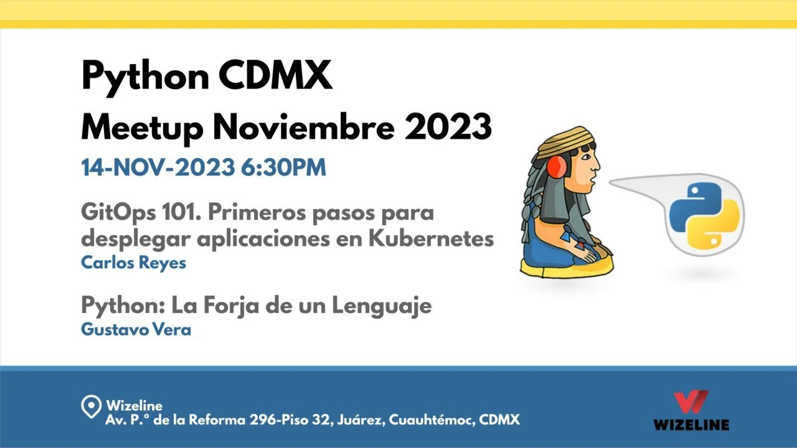
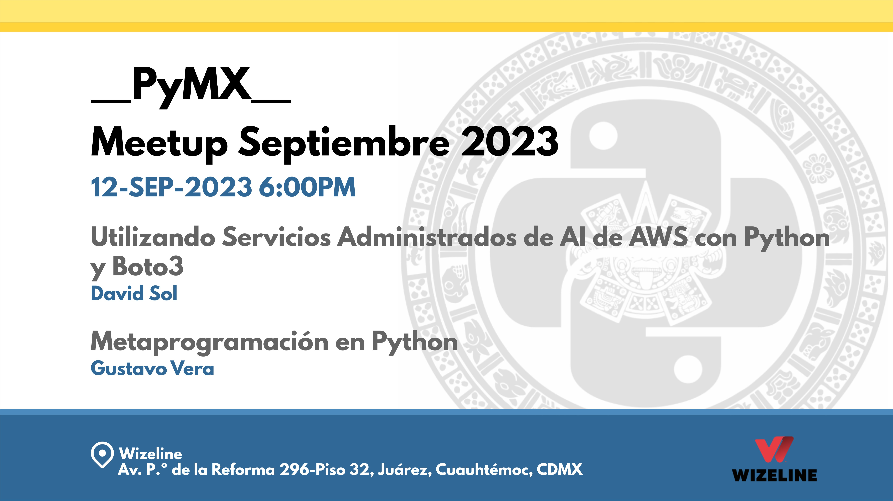

# Meetups 2023

Nuestro primer año como comunidad Python CDMX. Aquí encontrarás todos los meetups realizados en 2023.

---

## [GitOps: Automatizando el despliegue de aplicaciones](202311-noviembre.md)

!!! success "Meetup #PythonCDMX Noviembre 2023 - Doble Charla"

    **🎤 Ponente 1:** Carlos Reyes

    *GitOps: Automatizando el despliegue de aplicaciones*

    **🎤 Ponente 2:** Gustavo Vera

    *Historia de Python: De Guido van Rossum a la actualidad*

    **🗓️ Fecha:** Martes 14 de Noviembre, 18:30

    **📍 Lugar:** Wizeline México

    **RSVP:** https://www.meetup.com/python-mexico/

[Ver detalles →](202311-noviembre.md)

---

## [Jupyter a Web: De notebooks a aplicaciones web](202310-octubre.md)

!!! info "Meetup #PythonCDMX Octubre 2023"

    **🎤 Ponente:** Gustavo Vera

    **🗓️ Fecha:** Martes 10 de Octubre, 18:30

    **📍 Lugar:** Wizeline México

    **RSVP:** https://www.meetup.com/python-mexico/

[Ver detalles →](202310-octubre.md)

---

## [Metaprogramación en Python](202309-septiembre.md)

!!! success "Meetup #PythonCDMX Septiembre 2023 - Doble Charla"

    **🎤 Ponente 1:** David Sol

    *Metaprogramación en Python*

    **🎤 Ponente 2:** Gustavo Vera

    *AWS AI: Servicios de IA en la nube*

    **🗓️ Fecha:** Martes 12 de Septiembre, 18:30

    **📍 Lugar:** Wizeline México

    **RSVP:** https://www.meetup.com/python-mexico/

[Ver detalles →](202309-septiembre.md)

---

## Estadísticas 2023

- **Total meetups:** 3 realizados
- **Ponentes:** 3 ponentes diferentes
- **Temas principales:** GitOps, Jupyter, Metaprogramación, AWS AI

**Ponentes Destacados:**

- Gustavo Vera (3 charlas)
- David Sol (1 charla)
- Carlos Reyes (1 charla)

---

## Enlaces Útiles

- [Telegram](https://t.me/PythonCDMX)
- [Meetup](https://www.meetup.com/python-mexico)
- [YouTube](https://www.youtube.com/@PythonMexico)
- [GitHub](https://github.com/python-cdmx)

---

*Última actualización: {{ git_revision_date_localized }}*
