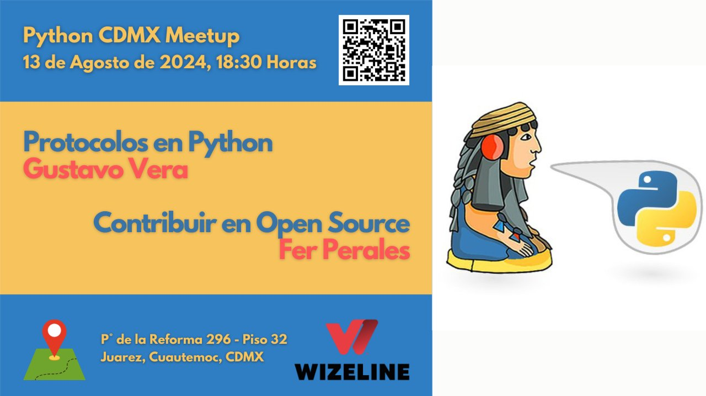
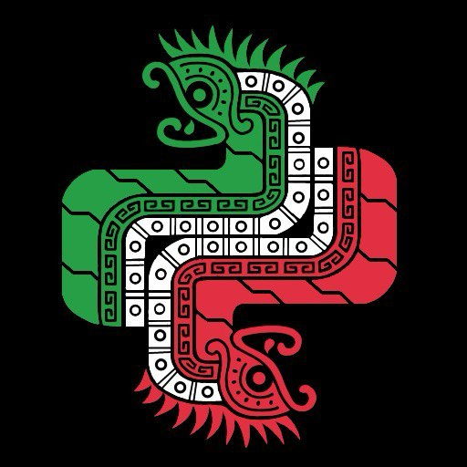

# Meetup #PythonCDMX <i class="fab fa-python"></i> - 13 2024

    <h2 style="margin: 0 0 1rem 0; font-size: 2.5rem;"> Protocolos en Python / Convertirse en Contribuidor Open Source</h2>
    
Dos charlas sobre tipado estático y contribución open source

    

## Información del Evento

    

        <h3 style="margin: 0 0 0.5rem 0; color: #28a745;"><i class="fas fa-calendar"></i> Fecha</h3>
        
Martes 13 de Agosto, 2024

    

    

        <h3 style="margin: 0 0 0.5rem 0; color: #007bff;"><i class="fas fa-clock"></i> Hora</h3>
        
18:30 - 21:00

    

    

        <h3 style="margin: 0 0 0.5rem 0; color: #dc3545;"><i class="fas fa-map-marker-alt"></i> Lugar</h3>
        
Wizeline México, Torre Diana

    

    

        <h3 style="margin: 0 0 0.5rem 0; color: white;"><i class="fas fa-gift"></i> ¡GRATIS!</h3>
        
Entrada completamente gratuita

    

    

        <h3 style="margin: 0 0 0.5rem 0; color: #ffc107;"><i class="fas fa-ticket-alt"></i> RSVP</h3>
        
<a href="https://www.meetup.com/python-mexico/" style="color: #ffc107; text-decoration: none;">¡Regístrate aquí!</a>

    

---

## Charlas y Ponentes

    

        <h3 style="margin: 0 0 0.5rem 0; font-size: 1.8rem;"><i class="fas fa-rocket"></i> Protocolos en Python: El poder del tipado estático avanzado</h3>
        
<i class="fas fa-stopwatch"></i> 45 minutos

    

    

        

            
        

        

            <h4 style="margin: 0 0 0.5rem 0; font-size: 1.5rem; color: #333;">Gustavo Vera</h4>
            
Python Developer

            
Desarrollador Python con experiencia en tipado estático y mejores prácticas de desarrollo.

            

                
                
                
            

        

    

    

        
Descubre cómo los Protocolos en Python pueden transformar tu código, haciéndolo más flexible y robusto. Explora desde conceptos básicos hasta aplicaciones avanzadas en esta plática única.

        
        

            
            

                <h5 style="margin: 0 0 0.5rem 0; color: #007bff; font-size: 1rem;"><i class="fas fa-clipboard-list"></i> Protocols</h5>
                
Tipado estático

            

            
            

                <h5 style="margin: 0 0 0.5rem 0; color: #28a745; font-size: 1rem;"><i class="fas fa-tag"></i> Type Hints</h5>
                
Anotaciones de tipo

            

            
            

                <h5 style="margin: 0 0 0.5rem 0; color: #ffc107; font-size: 1rem;"><i class="fas fa-search"></i> Static Typing</h5>
                
Tipado estático

            

            
        

        

        
Los Protocolos en Python ofrecen una forma poderosa de implementar tipado estático avanzado.

    

    

        <h3 style="margin: 0 0 0.5rem 0; font-size: 1.8rem;"><i class="fas fa-rocket"></i> Guía Práctica para Convertirse en Contribuidor de Open Source en 10 Años (o más)</h3>
        
<i class="fas fa-stopwatch"></i> 45 minutos

    

    

        

            
        

        

            <h4 style="margin: 0 0 0.5rem 0; font-size: 1.5rem; color: #333;">Fer Perales</h4>
            
Open Source Contributor

            
Contribuidor activo al ecosistema de Ruby con más de 10 años de experiencia en open source.

            

                
                
                
            

        

    

    

        
En una era donde todo mundo buscamos la satisfacción y los resultados inmediatos, compartiré mi camino de 10 años en el ecosistema de Ruby en el que me he convertido de usuario del lenguaje a contribuidor frecuente en una empresa con más de 1,000 millones de descargas de bibliotecas de Ruby. Los días son largos, pero los años son cortos y, si 10 años no son suficientes para convertirte en contribuidor de Open Source, siempre puedes tomar un año más y repetir el proceso.

        
        

            
            

                <h5 style="margin: 0 0 0.5rem 0; color: #28a745; font-size: 1rem;"><i class="fas fa-unlock"></i> Open Source</h5>
                
Software libre

            

            
            

                <h5 style="margin: 0 0 0.5rem 0; color: #CC342D; font-size: 1rem;"><i class="fas fa-gem"></i> Ruby</h5>
                
Lenguaje de programación

            

            
            

                <h5 style="margin: 0 0 0.5rem 0; color: #17a2b8; font-size: 1rem;"><i class="fas fa-users"></i> Community</h5>
                
Comunidad

            

            
        

        

        
Contribuir al open source es un viaje de largo plazo que requiere paciencia y dedicación.

    

---

## Video del Meetup

    

        <h3 style="margin: 0 0 1rem 0; color: #dc3545;"><i class="fas fa-tv"></i> ¡Mira las charlas completas!</h3>
        

            <iframe
                src="https://www.youtube.com/embed/97NmGheUxmE"
                title="Meetup PythonCDMX 13 2024"
                style="position: absolute; top: 0; left: 0; width: 100%; height: 100%; border-radius: 12px;"
                frameborder="0"
                allow="accelerometer; autoplay; clipboard-write; encrypted-media; gyroscope; picture-in-picture; web-share"
                allowfullscreen>
            </iframe>
        

        <a href="https://www.youtube.com/watch?v=97NmGheUxmE" style="background: #dc3545; color: white; padding: 0.75rem 1.5rem; border-radius: 25px; text-decoration: none; font-weight: 600; display: inline-block; transition: all 0.3s ease;"><i class="fab fa-youtube"></i> Ver en YouTube</a>
    

---

## Temas y Tecnologías

    

        
        <a href="/tags/python/" style="background: #3776AB; color: white; padding: 0.5rem 1rem; border-radius: 20px; font-weight: 600; text-decoration: none; transition: all 0.3s ease;"><i class="fab fa-python"></i> Python</a>
        
        <a href="/tags/protocols/" style="background: #007bff; color: white; padding: 0.5rem 1rem; border-radius: 20px; font-weight: 600; text-decoration: none; transition: all 0.3s ease;"><i class="fas fa-clipboard-list"></i> Protocols</a>
        
        <a href="/tags/type-hints/" style="background: #28a745; color: white; padding: 0.5rem 1rem; border-radius: 20px; font-weight: 600; text-decoration: none; transition: all 0.3s ease;"><i class="fas fa-tag"></i> Type Hints</a>
        
        <a href="/tags/open-source/" style="background: #28a745; color: white; padding: 0.5rem 1rem; border-radius: 20px; font-weight: 600; text-decoration: none; transition: all 0.3s ease;"><i class="fas fa-unlock"></i> Open Source</a>
        
        <a href="/tags/ruby/" style="background: #CC342D; color: white; padding: 0.5rem 1rem; border-radius: 20px; font-weight: 600; text-decoration: none; transition: all 0.3s ease;"><i class="fas fa-gem"></i> Ruby</a>
        
        <a href="/tags/community/" style="background: #17a2b8; color: white; padding: 0.5rem 1rem; border-radius: 20px; font-weight: 600; text-decoration: none; transition: all 0.3s ease;"><i class="fas fa-users"></i> Community</a>
        
    

---

## Networking

    <h3 style="margin: 0 0 1rem 0; font-size: 1.5rem;"><i class="fas fa-comments"></i> ¡Conecta con la comunidad!</h3>
    

        Después de las charlas habrá un tiempo de networking donde podrás platicar con programadores de diferentes niveles e intereses.
        ¡Es la oportunidad perfecta para hacer conexiones profesionales y aprender de otros desarrolladores!
    

---

## Enlaces de la Comunidad

    <a href="https://t.me/PythonCDMX" style="background: #0088cc; color: white; padding: 1rem; border-radius: 12px; text-decoration: none; text-align: center; font-weight: 600; transition: all 0.3s ease; display: flex; align-items: center; justify-content: center; gap: 0.5rem;">
        <i class="fab fa-telegram"></i> Telegram
    </a>
    <a href="https://www.meetup.com/python-mexico" style="background: #e51937; color: white; padding: 1rem; border-radius: 12px; text-decoration: none; text-align: center; font-weight: 600; transition: all 0.3s ease; display: flex; align-items: center; justify-content: center; gap: 0.5rem;">
        <i class="fab fa-meetup"></i> Meetup
    </a>
    <a href="https://www.youtube.com/@PythonMexico" style="background: #ff0000; color: white; padding: 1rem; border-radius: 12px; text-decoration: none; text-align: center; font-weight: 600; transition: all 0.3s ease; display: flex; align-items: center; justify-content: center; gap: 0.5rem;">
        <i class="fab fa-youtube"></i> YouTube
    </a>
    <a href="https://github.com/python-cdmx" style="background: #333; color: white; padding: 1rem; border-radius: 12px; text-decoration: none; text-align: center; font-weight: 600; transition: all 0.3s ease; display: flex; align-items: center; justify-content: center; gap: 0.5rem;">
        <i class="fab fa-github"></i> GitHub
    </a>

---

    

        *Última actualización: Generado automáticamente*
    

