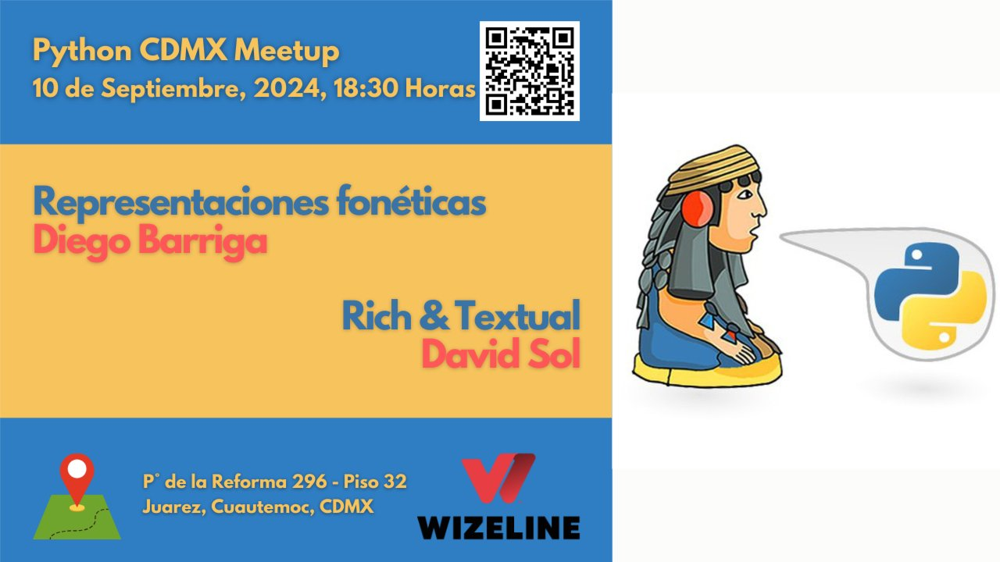
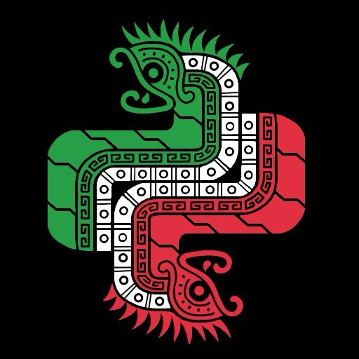

# Meetup #PythonCDMX <i class="fab fa-python"></i> - 10 2024

    <h2 style="margin: 0 0 1rem 0; font-size: 2.5rem;"> Representaciones Fonéticas / Rich & Textual</h2>
    
Dos charlas sobre fonética y interfaces de consola

    

## Información del Evento

    

        <h3 style="margin: 0 0 0.5rem 0; color: #28a745;"><i class="fas fa-calendar"></i> Fecha</h3>
        
Martes 10 de Septiembre, 2024

    

    

        <h3 style="margin: 0 0 0.5rem 0; color: #007bff;"><i class="fas fa-clock"></i> Hora</h3>
        
18:30 - 21:00

    

    

        <h3 style="margin: 0 0 0.5rem 0; color: #dc3545;"><i class="fas fa-map-marker-alt"></i> Lugar</h3>
        
Wizeline México, Torre Diana

    

    

        <h3 style="margin: 0 0 0.5rem 0; color: white;"><i class="fas fa-gift"></i> ¡GRATIS!</h3>
        
Entrada completamente gratuita

    

    

        <h3 style="margin: 0 0 0.5rem 0; color: #ffc107;"><i class="fas fa-ticket-alt"></i> RSVP</h3>
        
<a href="https://www.meetup.com/python-mexico/" style="color: #ffc107; text-decoration: none;">¡Regístrate aquí!</a>

    

---

## Charlas y Ponentes

    

        <h3 style="margin: 0 0 0.5rem 0; font-size: 1.8rem;"><i class="fas fa-rocket"></i> chit-chat: Representaciones fonéticas con python</h3>
        
<i class="fas fa-stopwatch"></i> 45 minutos

    

    

        

            
        

        

            <h4 style="margin: 0 0 0.5rem 0; font-size: 1.5rem; color: #333;">Diego Barriga</h4>
            
MLOps Engineer

            
Diego Barriga, Ingeniero en computación por la UNAM, trabajo con NLP y lenguas indígenas mexicanas. Es parte de Laboratorio de Investigación y Desarrollo de Software Libre, Comunidad Elotl y actualmente desempeña un puesto como MLOps en Mercado Libre. Promotor de la cultura libre, la privacidad, neovim y de andar en bicicleta sin frenos :)

            

                
                
                
            

        

    

    

        
¿Te has preguntado que estudia la fonética? ¿Que significan los simbolitos del International Phonetic Alphabet (IPA)? Y más importante; ¿Cómo manipular estos tipos de datos para crear aplicaciones con python? En esta charla desarrollaremos aplicaciones simples usando datasets con texto en representación fonética y aplicando conceptos sobre fonética en un nivel introductorio. Ahora si que, pasa la voz 🗣️. Objetivo: Los asistentes entenderán los principios básicos de fonología y que es un alfabeto fonético, Obtención y manipulación de datasets disponibles en GitHub https://github.com/open-dict-data/ipa-dict, Aplicar estos datos para resolver tareas específicas.

        
        

            
            

                <h5 style="margin: 0 0 0.5rem 0; color: #007bff; font-size: 1rem;"><i class="fas fa-file-alt"></i> NLP</h5>
                
Procesamiento de lenguaje

            

            
            

                <h5 style="margin: 0 0 0.5rem 0; color: #28a745; font-size: 1rem;"><i class="fas fa-language"></i> IPA</h5>
                
Alfabeto fonético

            

            
            

                <h5 style="margin: 0 0 0.5rem 0; color: #ffc107; font-size: 1rem;"><i class="fas fa-microphone"></i> Phonetics</h5>
                
Fonética

            

            
        

        

        
La fonética y el procesamiento de lenguaje natural abren nuevas posibilidades para aplicaciones Python.

    

    

        <h3 style="margin: 0 0 0.5rem 0; font-size: 1.8rem;"><i class="fas fa-rocket"></i> Rich y Textual: Haz tus aplicaciones en la consola visualmente atractivas</h3>
        
<i class="fas fa-stopwatch"></i> 45 minutos

    

    

        

            
        

        

            <h4 style="margin: 0 0 0.5rem 0; font-size: 1.5rem; color: #333;">David Sol</h4>
            
SRE Engineer

            
David Sol también estudió en la UNAM, así como sus padres, tíos, hermano, primos, hijos e incluso su conejo (historia real). Le gustan los juegos de Rol de tablero, las películas, los comics y los libros. Actualmente labora como SRE en Wizeline, y cree que el cómputo de nube es genial, así como Python.

            

                
                
                
            

        

    

    

        
Python nos ayuda a hacer excelentes aplicaciones que se ejecutan en la consola. Y además estas pueden ser atractivas visualmente, y tener interfaces de usuario de primer nivel. Vamos a hablar de dos librerías que te ayudan a ello, Rich y Textual. https://github.com/Textualize/rich https://textual.textualize.io

        
        

            
            

                <h5 style="margin: 0 0 0.5rem 0; color: #FF6B6B; font-size: 1rem;"><i class="fas fa-palette"></i> Rich</h5>
                
Librería de consola

            

            
            

                <h5 style="margin: 0 0 0.5rem 0; color: #4ECDC4; font-size: 1rem;"><i class="fas fa-desktop"></i> Textual</h5>
                
Framework TUI

            

            
            

                <h5 style="margin: 0 0 0.5rem 0; color: #6c757d; font-size: 1rem;"><i class="fas fa-laptop-code"></i> Console Apps</h5>
                
Aplicaciones de consola

            

            
        

        

        
Rich y Textual permiten crear aplicaciones de consola modernas y atractivas con Python.

    

---

## Video del Meetup

    

        <h3 style="margin: 0 0 1rem 0; color: #dc3545;"><i class="fas fa-tv"></i> ¡Mira las charlas completas!</h3>
        

            <iframe
                src="https://www.youtube.com/embed/Pq5ryqP95X0"
                title="Meetup PythonCDMX 10 2024"
                style="position: absolute; top: 0; left: 0; width: 100%; height: 100%; border-radius: 12px;"
                frameborder="0"
                allow="accelerometer; autoplay; clipboard-write; encrypted-media; gyroscope; picture-in-picture; web-share"
                allowfullscreen>
            </iframe>
        

        <a href="https://www.youtube.com/watch?v=Pq5ryqP95X0" style="background: #dc3545; color: white; padding: 0.75rem 1.5rem; border-radius: 25px; text-decoration: none; font-weight: 600; display: inline-block; transition: all 0.3s ease;"><i class="fab fa-youtube"></i> Ver en YouTube</a>
    

---

## Temas y Tecnologías

    

        
        <a href="/tags/python/" style="background: #3776AB; color: white; padding: 0.5rem 1rem; border-radius: 20px; font-weight: 600; text-decoration: none; transition: all 0.3s ease;"><i class="fab fa-python"></i> Python</a>
        
        <a href="/tags/nlp/" style="background: #007bff; color: white; padding: 0.5rem 1rem; border-radius: 20px; font-weight: 600; text-decoration: none; transition: all 0.3s ease;"><i class="fas fa-file-alt"></i> NLP</a>
        
        <a href="/tags/phonetics/" style="background: #ffc107; color: white; padding: 0.5rem 1rem; border-radius: 20px; font-weight: 600; text-decoration: none; transition: all 0.3s ease;"><i class="fas fa-microphone"></i> Phonetics</a>
        
        <a href="/tags/rich/" style="background: #FF6B6B; color: white; padding: 0.5rem 1rem; border-radius: 20px; font-weight: 600; text-decoration: none; transition: all 0.3s ease;"><i class="fas fa-palette"></i> Rich</a>
        
        <a href="/tags/textual/" style="background: #4ECDC4; color: white; padding: 0.5rem 1rem; border-radius: 20px; font-weight: 600; text-decoration: none; transition: all 0.3s ease;"><i class="fas fa-desktop"></i> Textual</a>
        
        <a href="/tags/console-apps/" style="background: #6c757d; color: white; padding: 0.5rem 1rem; border-radius: 20px; font-weight: 600; text-decoration: none; transition: all 0.3s ease;"><i class="fas fa-laptop-code"></i> Console Apps</a>
        
    

---

## Networking

    <h3 style="margin: 0 0 1rem 0; font-size: 1.5rem;"><i class="fas fa-comments"></i> ¡Conecta con la comunidad!</h3>
    

        Después de las charlas habrá un tiempo de networking donde podrás platicar con programadores de diferentes niveles e intereses.
        ¡Es la oportunidad perfecta para hacer conexiones profesionales y aprender de otros desarrolladores!
    

---

## Enlaces de la Comunidad

    <a href="https://t.me/PythonCDMX" style="background: #0088cc; color: white; padding: 1rem; border-radius: 12px; text-decoration: none; text-align: center; font-weight: 600; transition: all 0.3s ease; display: flex; align-items: center; justify-content: center; gap: 0.5rem;">
        <i class="fab fa-telegram"></i> Telegram
    </a>
    <a href="https://www.meetup.com/python-mexico" style="background: #e51937; color: white; padding: 1rem; border-radius: 12px; text-decoration: none; text-align: center; font-weight: 600; transition: all 0.3s ease; display: flex; align-items: center; justify-content: center; gap: 0.5rem;">
        <i class="fab fa-meetup"></i> Meetup
    </a>
    <a href="https://www.youtube.com/@PythonMexico" style="background: #ff0000; color: white; padding: 1rem; border-radius: 12px; text-decoration: none; text-align: center; font-weight: 600; transition: all 0.3s ease; display: flex; align-items: center; justify-content: center; gap: 0.5rem;">
        <i class="fab fa-youtube"></i> YouTube
    </a>
    <a href="https://github.com/python-cdmx" style="background: #333; color: white; padding: 1rem; border-radius: 12px; text-decoration: none; text-align: center; font-weight: 600; transition: all 0.3s ease; display: flex; align-items: center; justify-content: center; gap: 0.5rem;">
        <i class="fab fa-github"></i> GitHub
    </a>

---

    

        *Última actualización: Generado automáticamente*
    

