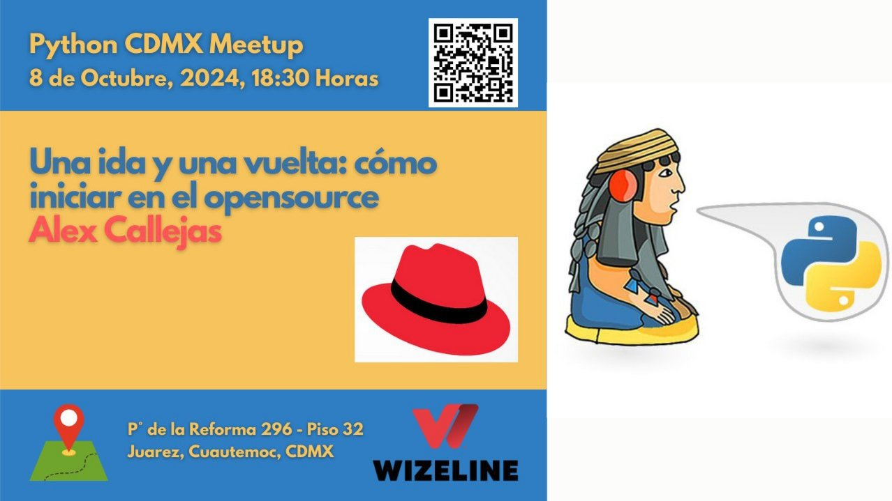

# Meetup #PythonCDMX <i class="fab fa-python"></i> - 8 2024

    <h2 style="margin: 0 0 1rem 0; font-size: 2.5rem;">Una ida y una vuelta: Cómo iniciar en el opensource</h2>
    
Guía práctica para contribuir al software libre

    

## Información del Evento

    

        <h3 style="margin: 0 0 0.5rem 0; color: #28a745;"><i class="fas fa-calendar"></i> Fecha</h3>
        
Martes 8 de Octubre, 2024

    

    

        <h3 style="margin: 0 0 0.5rem 0; color: #007bff;"><i class="fas fa-clock"></i> Hora</h3>
        
18:30 - 21:00

    

    

        <h3 style="margin: 0 0 0.5rem 0; color: #dc3545;"><i class="fas fa-map-marker-alt"></i> Lugar</h3>
        
Wizeline México, Torre Diana

    

    

        <h3 style="margin: 0 0 0.5rem 0; color: white;"><i class="fas fa-gift"></i> ¡GRATIS!</h3>
        
Entrada completamente gratuita

    

    

        <h3 style="margin: 0 0 0.5rem 0; color: #ffc107;"><i class="fas fa-ticket-alt"></i> RSVP</h3>
        
<a href="https://www.meetup.com/python-mexico/" style="color: #ffc107; text-decoration: none;">¡Regístrate aquí!</a>

    

---

## <i class="fas fa-microphone"></i> Ponente

    

        
    

    

        <h2 style="margin: 0 0 0.5rem 0; font-size: 2rem;">Alex Callejas</h2>
        
Services Content Architect

        
Alex Callejas es Services Content Architect de Red Hat, con base en la Ciudad de México y colaborador de diferentes comunidades OpenSource en Latinoamérica (como SysArmyMx o Fedora México). Con más de 20 años de experiencia como Sysadmin, tiene gran experiencia en hardening de infraestructura y automatización. Entusiasta del código abierto, apoya a la comunidad compartiendo sus conocimientos en diferentes eventos de acceso público y universidades. Autor del libro Fedora Linux Administration de la editorial Packt.

        

            
            
            
        

    

---

## Descripción de la Charla

    <h3 style="margin: 0 0 1rem 0; color: #28a745;"><i class="fas fa-rocket"></i> Una ida y una vuelta: Cómo iniciar en el opensource</h3>
    
Alex Callejas es Services Content Architect de Red Hat, con base en la Ciudad de México y colaborador de diferentes comunidades OpenSource en Latinoamérica (como SysArmyMx o Fedora México). Con más de 20 años de experiencia como Sysadmin, tiene gran experiencia en hardening de infraestructura y automatización. Entusiasta del código abierto, apoya a la comunidad compartiendo sus conocimientos en diferentes eventos de acceso público y universidades. Autor del libro Fedora Linux Administration de la editorial Packt (https://packt.link/Alex). Geek by nature, Linux by choice, Fedora of course.

    

        
        

            <h4 style="margin: 0 0 0.5rem 0; color: #28a745;"><i class="fas fa-unlock"></i> Open Source</h4>
            
Software libre

        

        
        

            <h4 style="margin: 0 0 0.5rem 0; color: #EE0000;"><i class="fas fa-circle"></i> Red Hat</h4>
            
Empresa de software

        

        
        

            <h4 style="margin: 0 0 0.5rem 0; color: #FCC624;"><i class="fab fa-linux"></i> Linux</h4>
            
Sistema operativo

        

        
        

            <h4 style="margin: 0 0 0.5rem 0; color: #294172;"><i class="fas fa-hat-cowboy"></i> Fedora</h4>
            
Distribución Linux

        

        
    

    
Contribuir al open source es una excelente manera de crecer profesionalmente y dar de vuelta a la comunidad.

---

## Video del Meetup

    

        <h3 style="margin: 0 0 1rem 0; color: #dc3545;"><i class="fas fa-tv"></i> ¡Mira la charla completa!</h3>
        

            <iframe
                src="https://www.youtube.com/embed/U3I5fVrnq-g"
                title="Meetup PythonCDMX 8 2024"
                style="position: absolute; top: 0; left: 0; width: 100%; height: 100%; border-radius: 12px;"
                frameborder="0"
                allow="accelerometer; autoplay; clipboard-write; encrypted-media; gyroscope; picture-in-picture; web-share"
                allowfullscreen>
            </iframe>
        

        <a href="https://www.youtube.com/watch?v=U3I5fVrnq-g" style="background: #dc3545; color: white; padding: 0.75rem 1.5rem; border-radius: 25px; text-decoration: none; font-weight: 600; display: inline-block; transition: all 0.3s ease;"><i class="fab fa-youtube"></i> Ver en YouTube</a>
    

---

## Temas y Tecnologías

    

        
        <a href="/tags/python/" style="background: #3776AB; color: white; padding: 0.5rem 1rem; border-radius: 20px; font-weight: 600; text-decoration: none; transition: all 0.3s ease;"><i class="fab fa-python"></i> Python</a>
        
        <a href="/tags/open-source/" style="background: #28a745; color: white; padding: 0.5rem 1rem; border-radius: 20px; font-weight: 600; text-decoration: none; transition: all 0.3s ease;"><i class="fas fa-unlock"></i> Open Source</a>
        
        <a href="/tags/linux/" style="background: #FCC624; color: white; padding: 0.5rem 1rem; border-radius: 20px; font-weight: 600; text-decoration: none; transition: all 0.3s ease;"><i class="fab fa-linux"></i> Linux</a>
        
        <a href="/tags/red-hat/" style="background: #EE0000; color: white; padding: 0.5rem 1rem; border-radius: 20px; font-weight: 600; text-decoration: none; transition: all 0.3s ease;"><i class="fas fa-circle"></i> Red Hat</a>
        
        <a href="/tags/fedora/" style="background: #294172; color: white; padding: 0.5rem 1rem; border-radius: 20px; font-weight: 600; text-decoration: none; transition: all 0.3s ease;"><i class="fas fa-hat-cowboy"></i> Fedora</a>
        
        <a href="/tags/community/" style="background: #17a2b8; color: white; padding: 0.5rem 1rem; border-radius: 20px; font-weight: 600; text-decoration: none; transition: all 0.3s ease;"><i class="fas fa-users"></i> Community</a>
        
    

---

## Networking

    <h3 style="margin: 0 0 1rem 0; font-size: 1.5rem;"><i class="fas fa-comments"></i> ¡Conecta con la comunidad!</h3>
    

        Después de la charla habrá un tiempo de networking donde podrás platicar con programadores de diferentes niveles e intereses.
        ¡Es la oportunidad perfecta para hacer conexiones profesionales y aprender de otros desarrolladores!
    

---

## Enlaces de la Comunidad

    <a href="https://t.me/PythonCDMX" style="background: #0088cc; color: white; padding: 1rem; border-radius: 12px; text-decoration: none; text-align: center; font-weight: 600; transition: all 0.3s ease; display: flex; align-items: center; justify-content: center; gap: 0.5rem;">
        <i class="fab fa-telegram"></i> Telegram
    </a>
    <a href="https://www.meetup.com/python-mexico" style="background: #e51937; color: white; padding: 1rem; border-radius: 12px; text-decoration: none; text-align: center; font-weight: 600; transition: all 0.3s ease; display: flex; align-items: center; justify-content: center; gap: 0.5rem;">
        <i class="fab fa-meetup"></i> Meetup
    </a>
    <a href="https://www.youtube.com/@PythonMexico" style="background: #ff0000; color: white; padding: 1rem; border-radius: 12px; text-decoration: none; text-align: center; font-weight: 600; transition: all 0.3s ease; display: flex; align-items: center; justify-content: center; gap: 0.5rem;">
        <i class="fab fa-youtube"></i> YouTube
    </a>
    <a href="https://github.com/python-cdmx" style="background: #333; color: white; padding: 1rem; border-radius: 12px; text-decoration: none; text-align: center; font-weight: 600; transition: all 0.3s ease; display: flex; align-items: center; justify-content: center; gap: 0.5rem;">
        <i class="fab fa-github"></i> GitHub
    </a>

---

    

        *Última actualización: Generado automáticamente*
    

