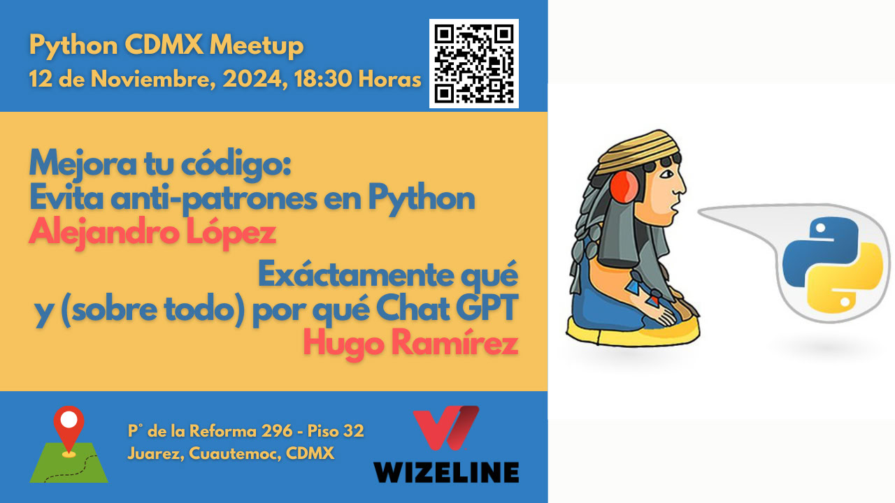
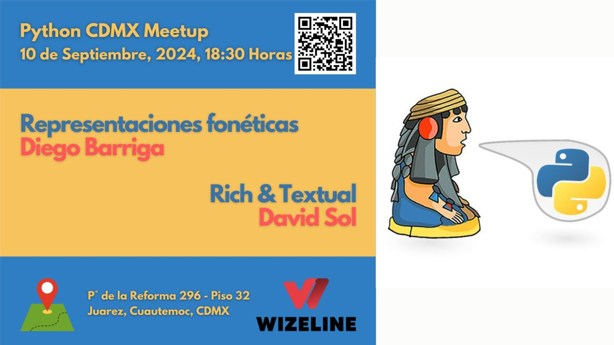
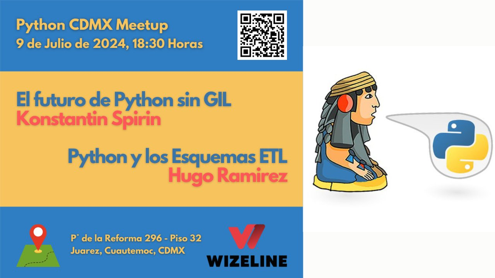
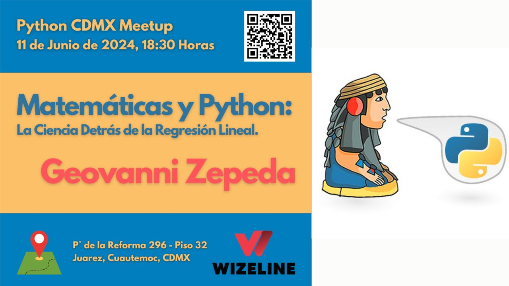
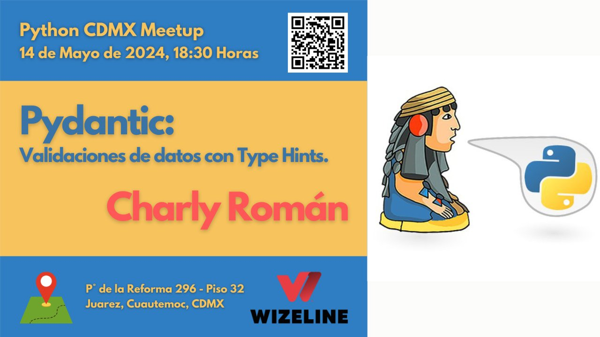
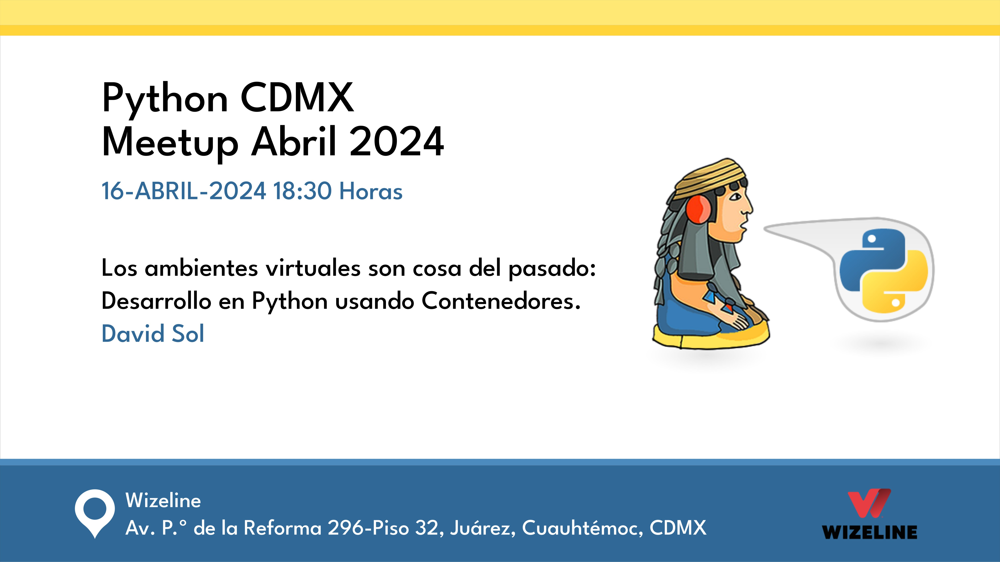
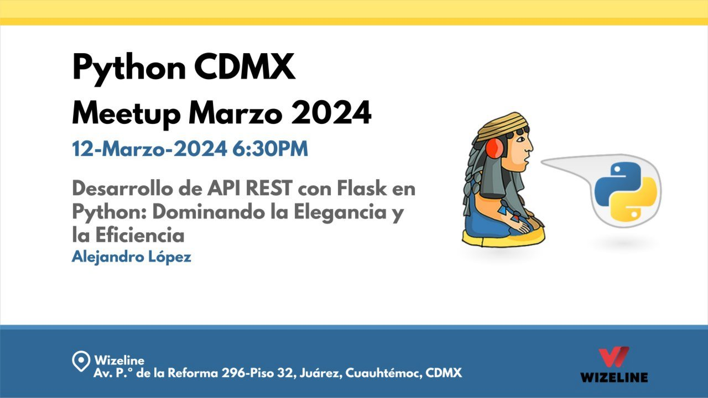
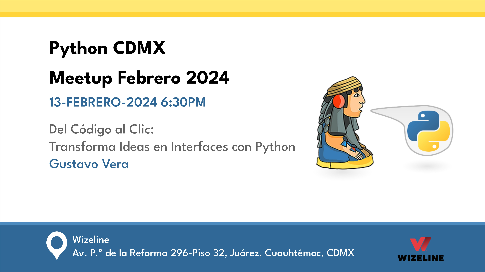
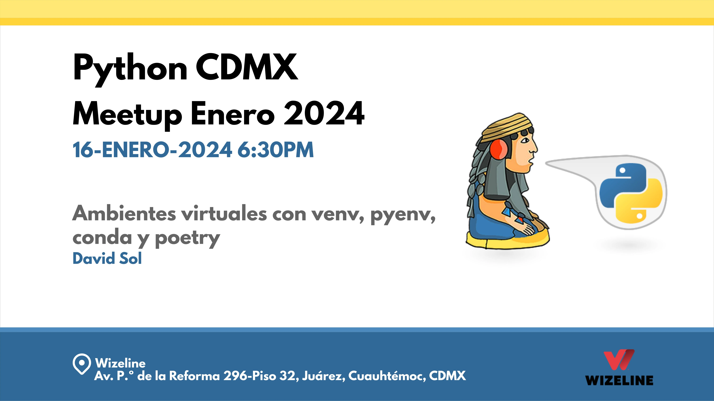

# Meetups 2024

En 2024, PythonCDMX continuó creciendo y fortaleciendo la comunidad de Python en la Ciudad de México. Aquí encontrarás todos los meetups realizados durante este año.

---

## [Evita Anti-patrones en Python / ¿Qué y por qué ChatGPT?](202411-noviembre.md)

!!! success "Meetup #PythonCDMX Noviembre 2024 - Doble Charla"

    **🎤 Ponente 1:** Alejandro Lopez

    *Mejora tu código: Evita anti-patrones en Python*

    **🎤 Ponente 2:** Hugo Ramírez

    *Exactamente qué y (sobre todo) por qué ChatGPT*

    **🗓️ Fecha:** Martes 12 de Noviembre, 18:30

    **📍 Lugar:** Wizeline México

    **RSVP:** https://www.meetup.com/python-mexico/

[Ver detalles →](202411-noviembre.md)

---

## [Contribuir a Open Source](202410-octubre.md)

!!! info "Meetup #PythonCDMX Octubre 2024"

    **🎤 Ponente:** Alex Callejas

    **🗓️ Fecha:** Martes 8 de Octubre, 18:30

    **📍 Lugar:** Wizeline México

    **RSVP:** https://www.meetup.com/python-mexico/

[Ver detalles →](202410-octubre.md)

---

## [Protocolos en Python](202409-septiembre.md)

!!! success "Meetup #PythonCDMX Septiembre 2024 - Doble Charla"

    **🎤 Ponente 1:** Diego Barriga

    *Protocolos en Python*

    **🎤 Ponente 2:** David Sol

    *Guía Open Source*

    **🗓️ Fecha:** Martes 10 de Septiembre, 18:30

    **📍 Lugar:** Wizeline México

    **RSVP:** https://www.meetup.com/python-mexico/

[Ver detalles →](202409-septiembre.md)

---

## [ETLs con Python](202408-agosto.md)

!!! success "Meetup #PythonCDMX Agosto 2024 - Doble Charla"

    **🎤 Ponente 1:** Gustavo Vera

    *ETLs con Python*

    **🎤 Ponente 2:** Fer Perales

    *GIL: Global Interpreter Lock*

    **🗓️ Fecha:** Martes 13 de Agosto, 18:30

    **📍 Lugar:** Wizeline México

    **RSVP:** https://www.meetup.com/python-mexico/

[Ver detalles →](202408-agosto.md)

---

## [Regresión Lineal](202407-julio.md)

!!! success "Meetup #PythonCDMX Julio 2024 - Doble Charla"

    **🎤 Ponente 1:** Konstantin Spirin

    *Regresión Lineal*

    **🎤 Ponente 2:** Hugo Ramirez

    *Fonética con Python*

    **🗓️ Fecha:** Martes 9 de Julio, 18:30

    **📍 Lugar:** Wizeline México

    **RSVP:** https://www.meetup.com/python-mexico/

[Ver detalles →](202407-julio.md)

---

## [Regresión Lineal](202406-junio.md)

!!! info "Meetup #PythonCDMX Junio 2024"

    **🎤 Ponente:** Geovanni Zepeda Martínez

    **🗓️ Fecha:** Martes 11 de Junio, 18:30

    **📍 Lugar:** Wizeline México

    **RSVP:** https://www.meetup.com/python-mexico/

[Ver detalles →](202406-junio.md)

---

## [Pydantic](202405-mayo.md)

!!! info "Meetup #PythonCDMX Mayo 2024"

    **🎤 Ponente:** Charly Román

    **🗓️ Fecha:** Martes 14 de Mayo, 18:30

    **📍 Lugar:** Wizeline México

    **RSVP:** https://www.meetup.com/python-mexico/

[Ver detalles →](202405-mayo.md)

---

## [Contenedores](202404-abril.md)

!!! info "Meetup #PythonCDMX Abril 2024"

    **🎤 Ponente:** David Sol

    **🗓️ Fecha:** Martes 9 de Abril, 18:30

    **📍 Lugar:** Wizeline México

    **RSVP:** https://www.meetup.com/python-mexico/

[Ver detalles →](202404-abril.md)

---

## [Flask APIs](202403-marzo.md)

!!! info "Meetup #PythonCDMX Marzo 2024"

    **🎤 Ponente:** Alejandro López

    **🗓️ Fecha:** Martes 12 de Marzo, 18:30

    **📍 Lugar:** Wizeline México

    **RSVP:** https://www.meetup.com/python-mexico/

[Ver detalles →](202403-marzo.md)

---

## [Entornos Virtuales](202402-febrero.md)

!!! info "Meetup #PythonCDMX Febrero 2024"

    **🎤 Ponente:** Gustavo Vera

    **🗓️ Fecha:** Martes 13 de Febrero, 18:30

    **📍 Lugar:** Wizeline México

    **RSVP:** https://www.meetup.com/python-mexico/

[Ver detalles →](202402-febrero.md)

---

## [PyPI](202401-enero.md)

!!! info "Meetup #PythonCDMX Enero 2024"

    **🎤 Ponente:** David Sol

    **🗓️ Fecha:** Martes 9 de Enero, 18:30

    **📍 Lugar:** Wizeline México

    **RSVP:** https://www.meetup.com/python-mexico/

[Ver detalles →](202401-enero.md)

---

## Estadísticas 2024

- **Total meetups:** 11 realizados
- **Ponentes:** 10 ponentes diferentes
- **Temas principales:** AI, Web Development, DevOps, Data Science, Open Source

**Ponentes Destacados:**

- Gustavo Vera (3 charlas)
- David Sol (3 charlas)
- Alejandro López (2 charlas)

---

## Enlaces Útiles

- [Telegram](https://t.me/PythonCDMX)
- [Meetup](https://www.meetup.com/python-mexico)
- [YouTube](https://www.youtube.com/@PythonMexico)
- [GitHub](https://github.com/python-cdmx)

---

*Última actualización: {{ git_revision_date_localized }}*
