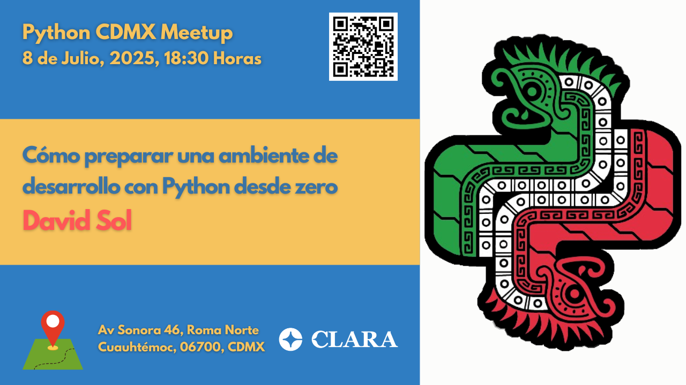
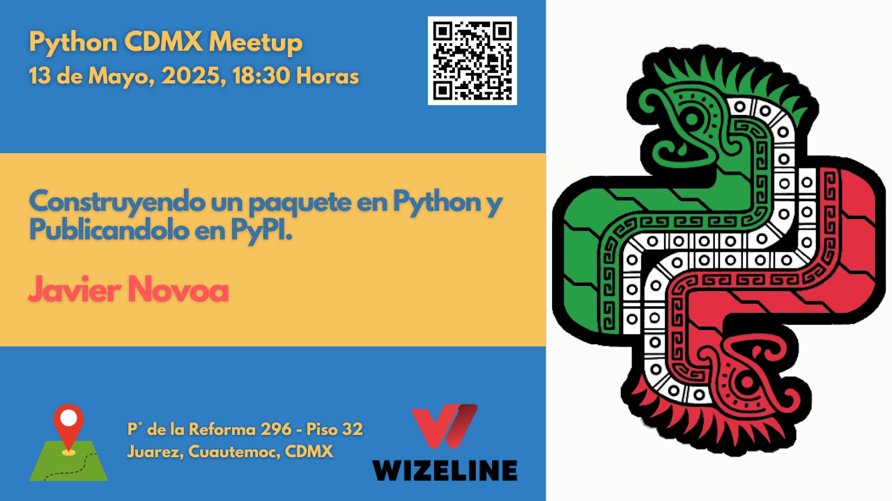
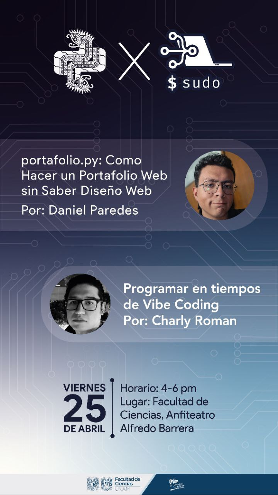
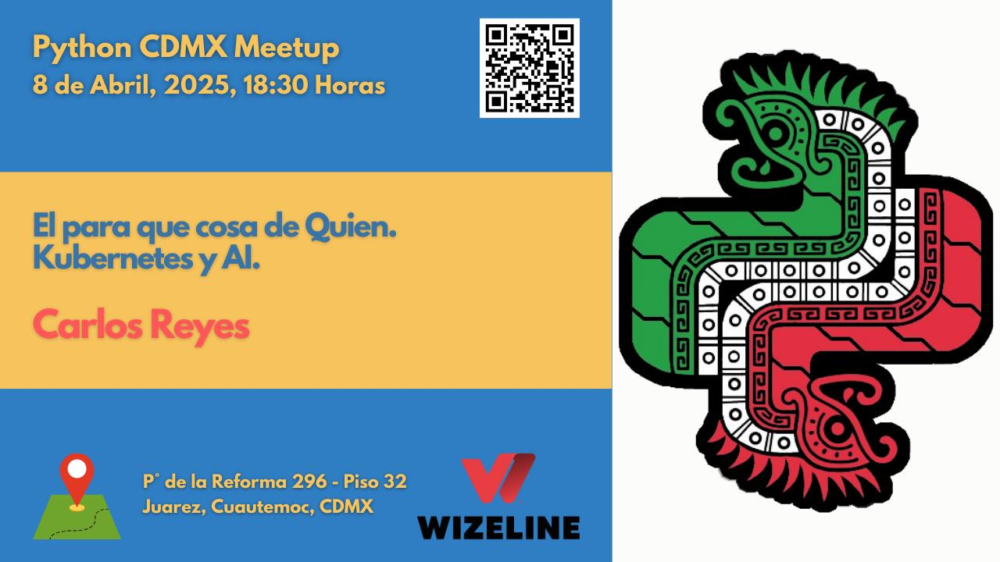
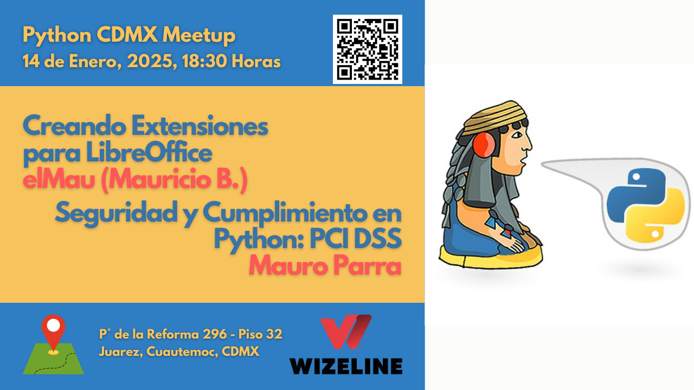

# Meetups 2025

Este año continuamos con nuestra misión de conectar desarrolladores Python en la Ciudad de México. Aquí encontrarás todos los meetups programados y realizados en 2025.

---

## [Cómo preparar una ambiente de desarrollo con Python desde zero](202507-julio.md)

| <i class="fas fa-calendar"></i> **Fecha** | <i class="fas fa-map-marker-alt"></i> **Lugar** | <i class="fas fa-user"></i> **Ponente** |
|:---|:---|:---|
| Martes 08 de Julio, 18:30 | Clara | David Sol |

**RSVP:** https://www.meetup.com/python-mexico/

[Ver detalles →](202507-julio.md)

---

## [Usando Python y software libre para crear nuevas herramientas: Traductor de voz español-inglés](202506-junio.md)

| <i class="fas fa-calendar"></i> **Fecha** | <i class="fas fa-map-marker-alt"></i> **Lugar** | <i class="fas fa-user"></i> **Ponente** |
|:---|:---|:---|
| Martes 10 de Junio, 18:30 | Wizeline México | Carlos Cesar Caballero |

**RSVP:** https://www.meetup.com/python-mexico/

[Ver detalles →](202506-junio.md)

---

## [Construyendo un paquete en Python y publicándolo en PyPI](202505-mayo.md)

| <i class="fas fa-calendar"></i> **Fecha** | <i class="fas fa-map-marker-alt"></i> **Lugar** | <i class="fas fa-user"></i> **Ponente** |
|:---|:---|:---|
| Martes 13 de Mayo, 18:30 | Wizeline México | Javier Novoa |

**RSVP:** https://www.meetup.com/python-mexico/

[Ver detalles →](202505-mayo.md)

---

## [portafolio.py: Como hacer un portafolio web sin saber diseño web](202504-abril.md)

| <i class="fas fa-calendar"></i> **Fecha** | <i class="fas fa-map-marker-alt"></i> **Lugar** | <i class="fas fa-user"></i> **Ponente** |
|:---|:---|:---|
| Viernes 25 de Abril, 16:00 | UNAM Facultad de Ciencias | Daniel Paredes |

<i class="fas fa-plus-circle"></i> **Charla adicional:** Programar en tiempos del Vibe-Coding - Charly Roman

**RSVP:** https://www.meetup.com/python-mexico/

[Ver detalles →](202504-abril.md)

---

## [El para que cosa de Quien. Kubernetes y AI](202504-abril.md)

| <i class="fas fa-calendar"></i> **Fecha** | <i class="fas fa-map-marker-alt"></i> **Lugar** | <i class="fas fa-user"></i> **Ponente** |
|:---|:---|:---|
| Martes 8 de Abril, 18:30 | Wizeline México | Carlos Reyes |

**RSVP:** https://www.meetup.com/python-mexico/

[Ver detalles →](202504-abril.md)

---

## [Mi Primer Agente de Inteligencia Artificial con Python](202503-marzo.md)

| <i class="fas fa-calendar"></i> **Fecha** | <i class="fas fa-map-marker-alt"></i> **Lugar** | <i class="fas fa-user"></i> **Ponente** |
|:---|:---|:---|
| Martes 11 de Marzo, 18:30 | Wizeline México | Erik Rivera |

<i class="fas fa-plus-circle"></i> **Charla adicional:** Interfases gráficas con Pyside6 - David Sol

**RSVP:** https://www.meetup.com/python-mexico/

[Ver detalles →](202503-marzo.md)

---

## [Lecciones del Advent of Code 2024](202502-febrero.md)

| <i class="fas fa-calendar"></i> **Fecha** | <i class="fas fa-map-marker-alt"></i> **Lugar** | <i class="fas fa-user"></i> **Ponente** |
|:---|:---|:---|
| Martes 11 de Febrero, 18:30 | Wizeline México | Manuel Rábade |

<i class="fas fa-plus-circle"></i> **Charla adicional:** Embeddings: El lenguaje como las máquinas entienden el lenguaje humano - Juan Guillermo Gómez

**RSVP:** https://www.meetup.com/python-mexico/

[Ver detalles →](202502-febrero.md)

---

## [Crea extensiones para LibreOffice con Python](202501-enero.md)

| <i class="fas fa-calendar"></i> **Fecha** | <i class="fas fa-map-marker-alt"></i> **Lugar** | <i class="fas fa-user"></i> **Ponentes** |
|:---|:---|:---|
| Martes 14 de Enero, 18:30 | Wizeline México | **elMau (Mauricio B.)** & **Mauro Parra** |

<i class="fas fa-users"></i> **Doble Charla:**

- **elMau (Mauricio B.):** Crea extensiones para LibreOffice con Python
- **Mauro Parra:** Seguridad y cumplimiento de Python: Garantizar el cumplimiento de PCI DSS

**RSVP:** https://www.meetup.com/python-mexico/

[Ver detalles →](202501-enero.md)

---

## Enlaces Útiles

| <i class="fab fa-telegram"></i> **Comunidad** | <i class="fas fa-calendar-alt"></i> **Eventos** | <i class="fab fa-youtube"></i> **Contenido** | <i class="fab fa-github"></i> **Código** |
|:---|:---|:---|:---|
| [Telegram](https://t.me/PythonCDMX) | [Meetup](https://www.meetup.com/python-mexico) | [YouTube](https://www.youtube.com/@PythonMexico) | [GitHub](https://github.com/python-cdmx) |

| <i class="fab fa-instagram"></i> **Social** | <i class="fab fa-linkedin"></i> **Profesional** |
|:---|:---|
| [Instagram](https://www.instagram.com/pythoncdmx/) | [LinkedIn](https://www.linkedin.com/groups/13126454/) |

---

*<i class="fas fa-clock"></i> Última actualización: {{ git_revision_date_localized }}*
