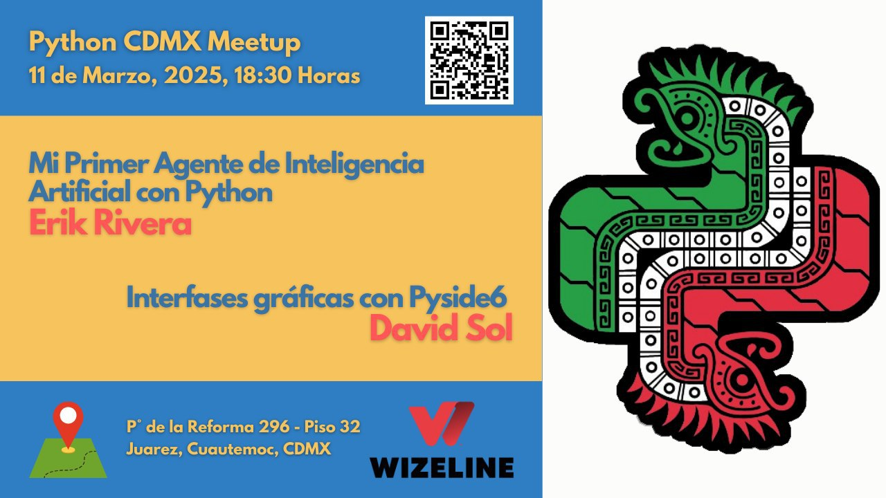

# Meetups 2025

Este año continuamos con nuestra misión de conectar desarrolladores Python en la Ciudad de México. Aquí encontrarás todos los meetups programados y realizados en 2025.

---

## [Usando Python y software libre para crear nuevas herramientas: Traductor de voz español-inglés](202506-junio.md)

!!! info "Meetup #PythonCDMX Junio 2025"

    **🎤 Ponente:** Carlos Cesar Caballero

    **🗓️ Fecha:** Martes 10 de Junio, 18:30

    **📍 Lugar:** Wizeline México

    **RSVP:** https://www.meetup.com/python-mexico/

[Ver detalles →](202506-junio.md)

---

## [Construyendo un paquete en Python y publicándolo en PyPI](202505-mayo.md)

!!! info "Meetup #PythonCDMX Mayo 2025"

    **🎤 Ponente:** Javier Novoa

    **🗓️ Fecha:** Martes 13 de Mayo, 18:30

    **📍 Lugar:** Wizeline México

    **RSVP:** https://www.meetup.com/python-mexico/

[Ver detalles →](202505-mayo.md)

---

## [portafolio.py: Como hacer un portafolio web sin saber diseño web](202504-abril.md)

!!! info "Meetup #PythonCDMX Abril 2025 (Extra)"

    **🎤 Ponente:** Daniel Paredes

    **🗓️ Fecha:** Viernes 25 de Abril, 16:00

    **📍 Lugar:** UNAM Facultad de Ciencias

    **💬 Charla adicional:** Programar en tiempos del Vibe-Coding - Charly Roman

    **RSVP:** https://www.meetup.com/python-mexico/

[Ver detalles →](202504-abril.md)

---

## [El para que cosa de Quien. Kubernetes y AI](202504-abril.md)

!!! info "Meetup #PythonCDMX Abril 2025"

    **🎤 Ponente:** Carlos Reyes

    **🗓️ Fecha:** Martes 8 de Abril, 18:30

    **📍 Lugar:** Wizeline México

    **RSVP:** https://www.meetup.com/python-mexico/

[Ver detalles →](202504-abril.md)

---

## [Mi Primer Agente de Inteligencia Artificial con Python](202503-marzo.md)

!!! info "Meetup #PythonCDMX Marzo 2025"

    **🎤 Ponente:** Erik Rivera

    **🗓️ Fecha:** Martes 11 de Marzo, 18:30

    **📍 Lugar:** Wizeline México

    **💬 Charla adicional:** Interfases gráficas con Pyside6 - David Sol

    **RSVP:** https://www.meetup.com/python-mexico/

[Ver detalles →](202503-marzo.md)

---

## [Lecciones del Advent of Code 2024](202502-febrero.md)

!!! info "Meetup #PythonCDMX Febrero 2025"

    **🎤 Ponente:** Manuel Rábade

    **🗓️ Fecha:** Martes 11 de Febrero, 18:30

    **📍 Lugar:** Wizeline México

    **💬 Charla adicional:** Embeddings: El lenguaje como las máquinas entienden el lenguaje humano - Juan Guillermo Gómez

    **RSVP:** https://www.meetup.com/python-mexico/

[Ver detalles →](202502-febrero.md)

---

## [Crea extensiones para LibreOffice con Python](202501-enero.md)

!!! success "Meetup #PythonCDMX Enero 2025 - Doble Charla"

    **🎤 Ponente 1:** elMau (Mauricio B.)

    *Crea extensiones para LibreOffice con Python*

    **🎤 Ponente 2:** Mauro Parra

    *Seguridad y cumplimiento de Python: Garantizar el cumplimiento de PCI DSS*

    **🗓️ Fecha:** Martes 14 de Enero, 18:30

    **📍 Lugar:** Wizeline México

    **RSVP:** https://www.meetup.com/python-mexico/

[Ver detalles →](202501-enero.md)

---

## Estadísticas 2025

- **Total meetups:** 6 programados
- **Completados:** 5 meetups
- **Próximos:** 1 meetup
- **Eventos especiales:** 1 (UNAM)

**Temas Principales:**

- AI & Machine Learning, Open Source, Web Development, Security, DevOps

**Ponentes Destacados:**

- David Sol, Carlos Reyes, Javier Novoa, Carlos Cesar Caballero

---

## Enlaces Útiles

- [Telegram](https://t.me/PythonCDMX)
- [Meetup](https://www.meetup.com/python-mexico)
- [YouTube](https://www.youtube.com/@PythonMexico)
- [GitHub](https://github.com/python-cdmx)

---

*Última actualización: {{ git_revision_date_localized }}*
