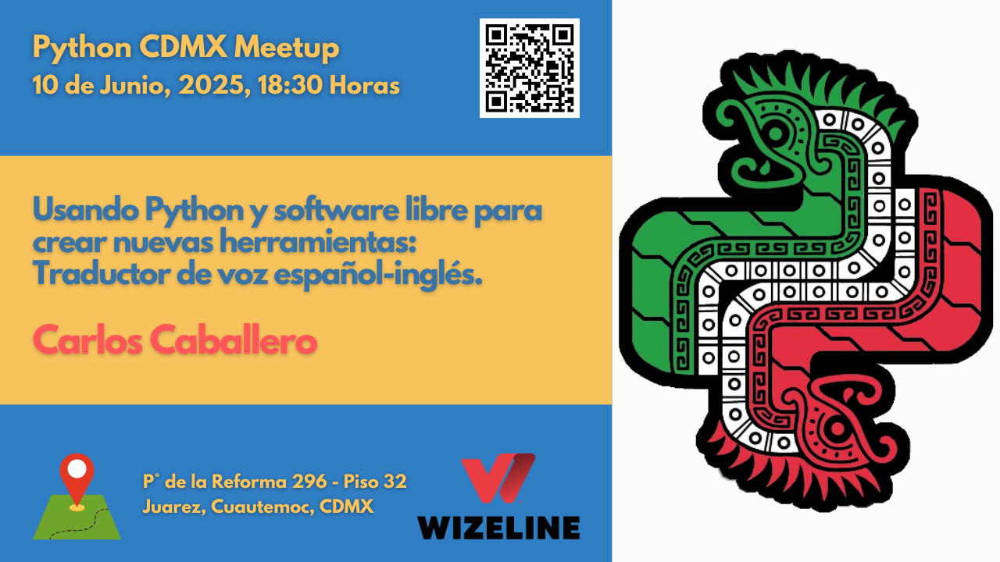

# Meetups Python CDMX <i class="fas fa-code"></i>

> **#PythonCDMX** es un grupo de personas interesadas en aprender y compartir su conocimiento sobre el lenguaje de programación Python. El objetivo es estar en contacto con más gente interesada en innovación y tecnología.

---

## <i class="fas fa-home"></i> ¡Bienvenido a Nuestra Comunidad!

¡Bienvenido a nuestra vibrante comunidad de Python en la Ciudad de México! Aquí encontrarás todas las charlas, talleres y eventos que hemos realizado desde 2023.

---

## <i class="fas fa-info-circle"></i> ¿Qué Encontrarás Aquí?

| <i class="fas fa-graduation-cap"></i> **Charlas Inspiradoras** | <i class="fas fa-users"></i> **Comunidad Activa** |
|:---|:---|
| Desde conceptos básicos hasta técnicas avanzadas, nuestros ponentes comparten conocimiento práctico y experiencias reales. | Conecta con otros desarrolladores Python, comparte ideas y construye relaciones profesionales. |

| <i class="fas fa-download"></i> **Recursos Valiosos** | <i class="fas fa-tags"></i> **Temas Diversos** |
|:---|:---|
| Código, slides, videos y materiales de cada meetup para que puedas aprender a tu ritmo. | Explora AI, Web Development, DevOps, Data Science, Open Source y Python Avanzado. |

---

## <i class="fas fa-calendar-alt"></i> Explora Nuestros Meetups

| [Meetups 2025](2025/index.md) <i class="fas fa-calendar"></i> | [Meetups 2024](2024/index.md) <i class="fas fa-graduation-cap"></i> | [Meetups 2023](2023/index.md) <i class="fas fa-seedling"></i> |
|:---|:---|:---|
| **¡Eventos Actuales!** - Descubre nuestros próximos eventos y las charlas más recientes de este año. | **Un Año de Aprendizaje** - Revive las mejores charlas del año pasado sobre AI, Web Development, DevOps y más. | **Nuestros Inicios** - Conoce cómo empezó nuestra comunidad con charlas sobre GitOps, Python History y Jupyter. |

---

## <i class="fas fa-tags"></i> ¿Qué Temas Te Interesan?

Explora nuestros meetups por año y descubre charlas sobre:

| <i class="fas fa-brain"></i> **AI & Machine Learning** | <i class="fas fa-globe"></i> **Web Development** | <i class="fas fa-cloud"></i> **DevOps & Cloud** |
|:---|:---|:---|
| ChatGPT, embeddings, agentes de IA | APIs, frameworks, desarrollo web | GitOps, contenedores, Kubernetes |

| <i class="fas fa-chart-line"></i> **Data Science** | <i class="fas fa-code-branch"></i> **Open Source** | <i class="fas fa-cogs"></i> **Python Avanzado** |
|:---|:---|:---|
| Análisis de datos, ETLs, visualización | Contribuciones, herramientas libres | Metaprogramación, protocolos, optimización |

<i class="fas fa-star"></i> **¡Cada meetup tiene algo nuevo que aprender!**

---

## <i class="fas fa-download"></i> Recursos para Aprender

### <i class="fab fa-youtube"></i> YouTube Channel
Todos nuestros meetups se transmiten en vivo y quedan disponibles en nuestro canal de YouTube.

| <i class="fas fa-file-alt"></i> **Slides y Código** | <i class="fas fa-handshake"></i> **Networking** |
|:---|:---|
| Muchos ponentes comparten sus presentaciones y código de ejemplo. Busca en cada meetup individual para encontrar los recursos. | Cada meetup incluye tiempo de networking para conectar con otros desarrolladores de la comunidad. |

---

## <i class="fas fa-plus-circle"></i> ¡Únete a Nuestra Comunidad!

### <i class="fas fa-microphone"></i> ¿Quieres Dar una Charla?

¿Tienes algo interesante que compartir? ¡Nos encantaría escucharte!

| <i class="fas fa-list-ol"></i> **Proceso** | <i class="fas fa-check-circle"></i> **Requisitos** |
|:---|:---|
| 1. **Contacta** con nosotros por [Telegram](https://t.me/PythonCDMX) | <i class="fab fa-python"></i> Conocimiento de Python (cualquier nivel) |
| 2. **Propón** tu tema y descripción | <i class="fas fa-heart"></i> Ganas de compartir y aprender |
| 3. **Coordina** fecha y detalles | <i class="fas fa-clock"></i> 20-30 minutos de presentación |
| 4. **¡Presenta** tu charla! | <i class="fas fa-file-code"></i> Opcional: slides o demo |

---

### <i class="fas fa-user-plus"></i> ¿Quieres Asistir?

<i class="fas fa-star"></i> **Beneficios de participar:**

| <i class="fas fa-gift"></i> **Gratis** | <i class="fas fa-map-marker-alt"></i> **Presencial** | <i class="fas fa-video"></i> **Virtual** | <i class="fas fa-handshake"></i> **Networking** |
|:---|:---|:---|:---|
| Todos nuestros meetups son gratuitos | Wizeline México, UNAM y otros lugares (consulta cada evento) | Transmisión en vivo por YouTube | Tiempo para conectar con la comunidad |

---

## <i class="fas fa-newspaper"></i> ¿Qué Hay de Nuevo?

<i class="fas fa-bell"></i> **¡Mantente al día con nuestros eventos más recientes!**

### [Ver Meetups 2025](2025/index.md)
<i class="fas fa-calendar"></i> **Descubre nuestros próximos eventos y las charlas más recientes.**

---

*<i class="fas fa-clock"></i> Última actualización: {{ git_revision_date_localized }}*

## 🔗 Enlaces Útiles

| <i class="fab fa-telegram"></i> **Comunidad** | <i class="fas fa-calendar-group"></i> **Eventos** | <i class="fab fa-youtube"></i> **Contenido** | <i class="fab fa-github"></i> **Código** |
|:---|:---|:---|:---|
| [Telegram](https://t.me/PythonCDMX) | [Meetup](https://www.meetup.com/python-mexico) | [YouTube](https://www.youtube.com/@PythonMexico) | [GitHub](https://github.com/python-cdmx) |

| <i class="fab fa-instagram"></i> **Social** | <i class="fab fa-linkedin"></i> **Profesional** |
|:---|:---|
| [Instagram](https://www.instagram.com/pythoncdmx/) | [LinkedIn](https://www.linkedin.com/groups/13126454/) |
